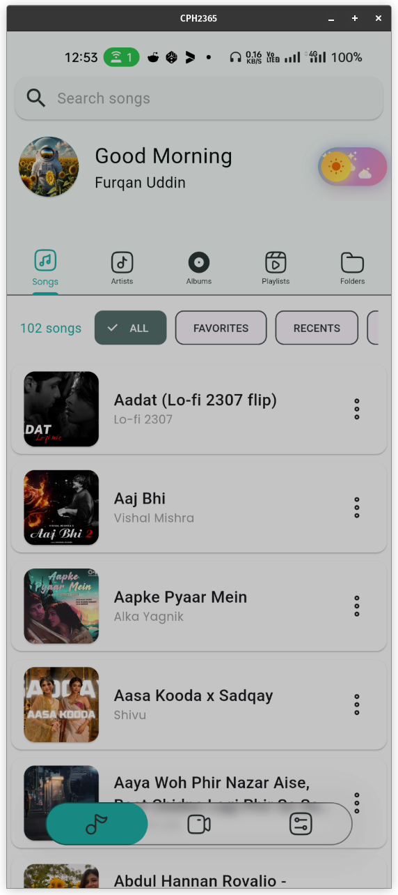
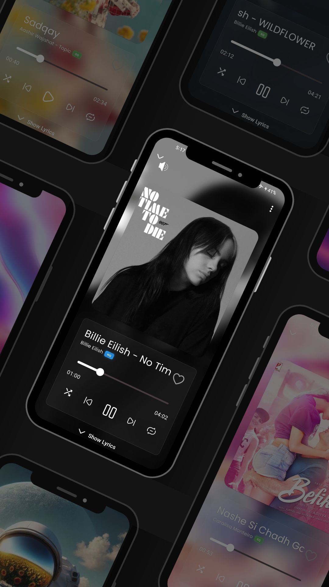
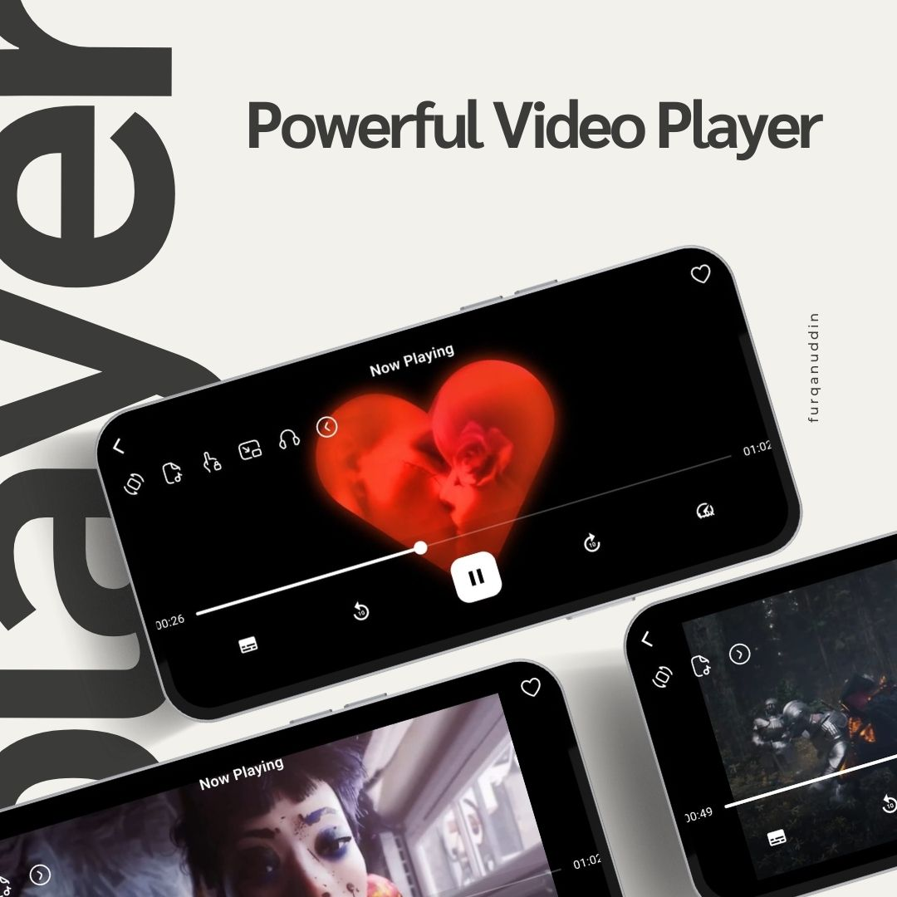
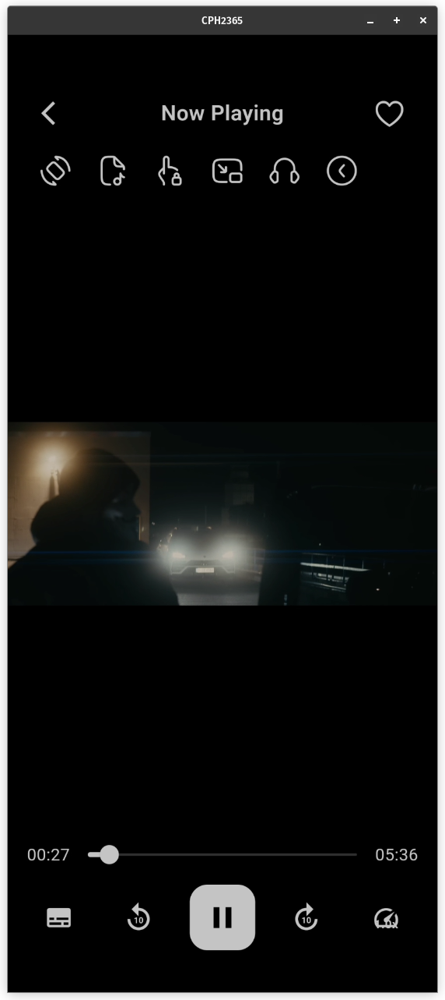

# Player - Elegant Multimedia Player

Player is a beautifully designed, feature-rich offline media player for Android, offering a premium multimedia experience without ads, subscriptions, or privacy compromises. Crafted with Flutter, Player delivers smooth playback for both audio and video files stored locally on your device.

## 🌟 Key Highlights

- 📱 **Full Offline Functionality**
- 🎵 Audio & Video Playback
- 🚫 Zero Ads
- 🔒 Complete Privacy
- 🎨 Modern, Elegant UI

## 🚀 Features

### Media Playback
- 🎬 Full Video Support
- 🎵 Comprehensive Audio Playback
- 📂 Local Media Library Management
- 🖥️ Multiple Codec Support

### Customization
- 🌓 Dark and Light Themes
- 🎨 Customizable Accent Colors
- 🌈 Multiple UI Themes
- 🌍 Multi-Language Support

### Advanced Capabilities
- 📋 Playlist Creation
- 🔍 Powerful Media Search
- 📝 Lyrics Display (for Audio)
- 📊 Playback History
- 🎚️ Advanced Equalizer
- 💾 Efficient Media Caching
- 🖼️ Album Art Support

### Technical Excellence
- 💻 Built with Flutter
- 🚀 High-Performance Rendering
- 📱 Android Platform (Initial Release)

## 📸 Screenshots

*Placeholder for app screenshots*

## 🛠 Installation

### Requirements
- Android Device
- Minimum Android Version: 7.0

### Download
- [Direct APK Download](link-to-release)
- Available on [GitHub Releases](link-to-releases)

## 🤝 Contributing

Interested in contributing? Great! Check out our [Contribution Guidelines](CONTRIBUTING.md).

### Quick Contribution Steps
1. Fork the Repository
2. Create Feature Branch
3. Commit Changes
4. Push to Branch
5. Open Pull Request

## 🗺️ Roadmap
- [ ] Performance Optimizations
- [ ] Additional Codec Support
- [ ] Tablet UI Improvements
- [ ] Network Streaming (Optional)

## 📞 Support

- 🐛 [Report Issues](https://github.com/frkudn/player/issues)
- ✉️ Contact: [frkudn@protonmail.com](mailto:frkudn@protonmail.com)

## 📄 License

Distributed under MIT License. See `LICENSE` for details.

---

**Pure Media, Pure Experience 🎬🎵**

*Player - Your Media, Your Control*
